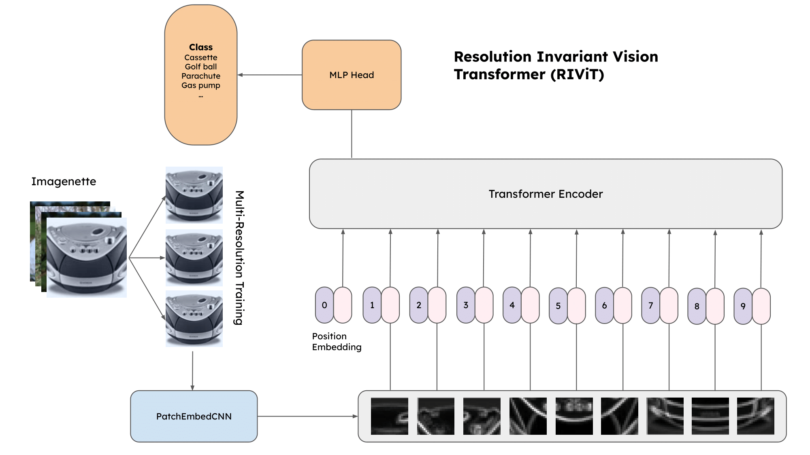
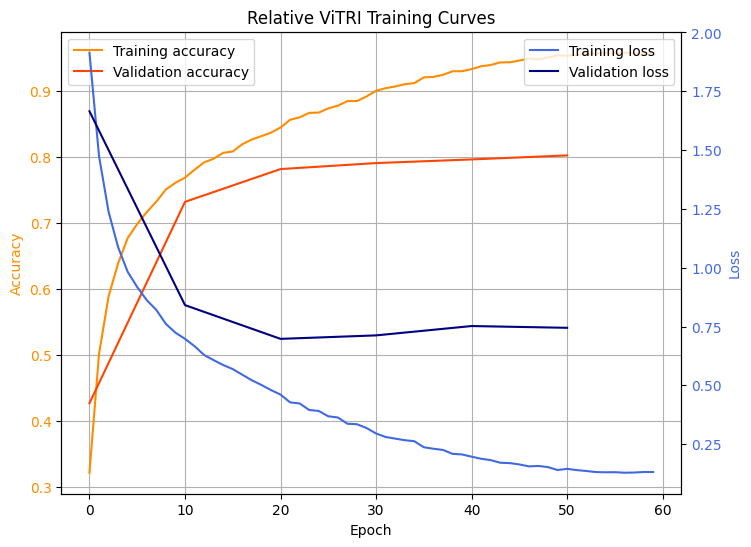
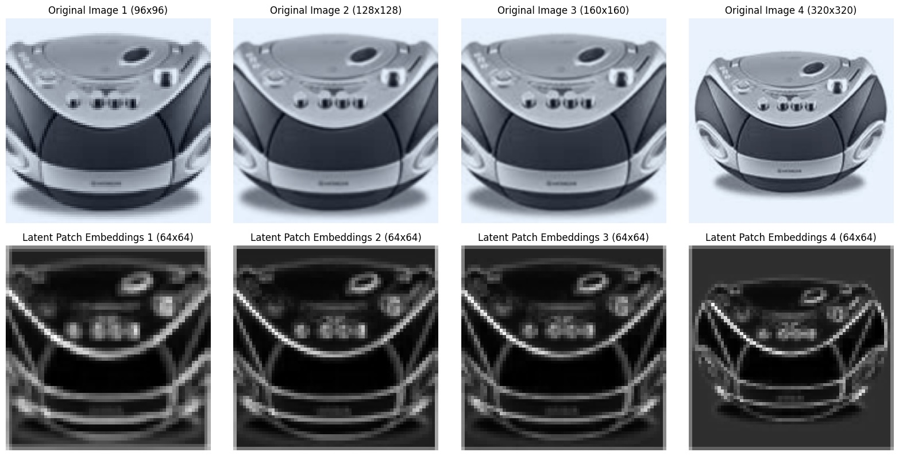

# 🐸 RIViT: Resolution Invariant Vision Transformer

_6.7960 Final Project_

_By Kelly Cui, Andrew Woo, Sophia Zheng_

_12/10/2024_

---

## 1. Introduction

In applications like Natural Language Processing, transformers have quickly become dominant models because of their scalibility and ability to capture long-range dependencies. Vision Transformers (ViTs) adapt the transformer architecture from text to image data. While ViTs perform effectively with large datasets, they still struggle in performance compared to existing convolutional neural network (CNN) models, especially in smaller datasets.

In particular, CNNs outperform ViTs in generalizing across different image resolutions. Our project is interested in improving current ViT architecture by building **resolution invariant ViTs**. Objects naturally appear at different sizes and image resolution. Improving resolution invariance in ViTs poses benefits to fields like healthcare, autonomous systems, and urban planning, where tasks like image classification and semantic segmentation help with object recognition in medical scans and satellite images, input images that often cover a diverse range of sizes.

We focus on two areas of improvement: _standardizing patch embedding lengths across different resolutions_ and _experimenting with positional encodings to combat spatial locality_.

Currently, ViTs struggle with resolution scalability, particularly for high-resolution images. When processing ViTs on image input sizes much larger than those from training, model performance declines. To address this, we propose a novel model to improve ViT task accuracy in image classification. For positional encoding, we will test on absolute and relative positional encoding. We hypothesize that standardizing patch embedding lengths and introducing absolute or relative positional encoding will improve task accuracy in classification by dynamically adapting to resolution variability compared to a baseline ViT model.

## 2. Related Work

### 2.1. ViT with Any Resolution

ViTAR[^1], or ViT with Any Resolution describes a transformer architecture that uses an adaptive token merger to give fixed size token arrays to be fed into a standard transformer, with fuzzy positional encodings. The token merger uses adaptive "GridAttention" based on image resolution, which is a combination of average pooling with CrossAttention.

### 2.2. Resformer

Resformer[^2] proposes multi-resolution training for ViTs to improve resolution invariance. Our model's novelty lies in its positional encoding methods as well as its use of adaptive pooling during patch embedding to remain resolution invariant.

### 2.3. Multi-Scale Vision Longformer

Multi-Scale Vision Longformer[^3] details combining a multi-scale model structure and a Vision Longformer, with attention mechanisms adapted from standard Longformers. This stacks more ViT stages to achieve the multi-scale structure of deep CNNs. Our approach of convolution on patch embedding leverages CNN feature extraction to achieve similar benefits, hybridizing advantages of local CNN extraction and global Transformer modeling.

---

## 3. Methodology

Our baseline model for comparison will be a vanilla ViT model using learned positional encodings. We will compare the performance of our novel models against the baseline for the task of image classification, using the Imagenette dataset. We will follow ResFormer's training methodology to perform multi-resolution training.

### 3.1. Dataset

We train on Imagenette, a subset of ImageNet with 10 distinct classes (tench, English springer, cassette player, chain saw, church, French horn, garbage truck, gas pump, golf ball, parachute). Imagenette consists of ~13,000 images, with a 70/30 train/validation split.

Images from Imagenette are loaded with their shorter dimension set to 320px. For training purposes, images are cropped, resized, and normalized to obtain square images. Following Resformer's multi-resolution training method, each training image is scaled to three different resolutions: 96px, 128px, and 160px.

#### 3.1.1. Data Augmentations

To improve the robustness of our model, we apply a few random data augmentations:

1. Random horizontal flip (p=0.5)
2. Random rotation (-15˚ to 15˚)
3. Random color jitter (brightness=0.2, contrast=0.2, saturation=0.2, hue=0.1)

### 3.2. Convolutional Patch Embeddings

To achieve resolution invariance, we use convolution and adaptive pooling layers on patch embedding outputs to reduce tokens to a fixed size.
$$ \text{y} = AdaptiveAvgPool2d(ReLU(Conv2d(ReLU(Conv2d(\text{x})))), (64, 64)) $$

Our CNN patch embeddings downsample the input image to extract important local features with conv2D layers before creating patches. The downsampling block is composed of 2 conv2d layers with ReLU activations; each layer convolves a 3×3 kernel with padding to preserve the input resolution. Adaptive average pooling ensures that the patches are resized to 64×64 regardless of input size, making the model robust to different resolutions with a fixed token size. We then split the downsampled, pooled feature map into non-overlapping patches like usual.

This is expected to perform better than vanilla ViTs, where images are directly split into patches, and feature learning does not occur until later on in the Transformer architecture. Our baseline vanilla and augment ViTs employ non-overlapping patch embedding, where the stride is the kernel size, making the number of input tokens $\left\lfloor{h \over h_k} \right\rfloor \times \left\lfloor{w \over w_k} \right\rfloor$.

We hypothesize that learnable conv2D layers will capture more localized features with average pooling to preserve high-resolution data fed into the base transformer.

### 3.3. Positional Encodings

Along with the convolutional patch embeddings, we experiment with positional encodings to improve our model's resolution invariance.

The basic transformer architecture is permutation-invariant (with the exception of masked attention); the order of the input tokens does not impact the output of self attention layers. However, token positions can be crucial for both NLP and vision tasks: for example, the position of a word can change the meaning of a sentence, and the location of a patch in an image can correlate to the object it represents.

Hence, we need _positional encodings_ to enable our models to learn from the positions of tokens in the input. The choice of positional encoding is especially important for resolution invariance; as resolutions vary, so do the number of possible positions. The positional encoding must be capable of handling different token sequence lengths.

In our models, we explore three different options for positional encodings.

#### 3.3.1. Learned Positional Encodings

Each position is mapped to a vector of parameters with the same dimension as the token embeddings, and these vectors are added to the token embeddings at each forward pass of the model. This positional encoding matrix is initialized randomly and learned by the model during training.

Learned positional encodings have the advantage of being tailored to the task at hand, but suffer the drawback of only being trained on limited resolution sizes. Hence, they may not be able to generalize effectively to unseen longer resolution sizes.

#### 3.3.2. Sinusoidal Position Encodings

Sinusoidal position encodings also add position encoding vectors to the token embeddings, but this vector is calculated based on a fixed sinusoidal function instead of learned during training.

We implement the sinusoidal encodings as follows, based on the original Transformers paper [^4]:

$$
PE_{(pos, i)} = \begin{cases}
    \sin\left(\frac{pos}{10,000^{i/dim}}\right) & \text{for $i$ even} \\
    \cos\left(\frac{pos}{10,000^{i/dim}}\right) & \text{for $i$ odd}
\end{cases}
$$

Here, $pos$ is the position index, $i$ is the $i$-th index of positional encoding for $pos$, and $dim$ is the dimension of the token embeddings.

This function extends easily to unseen resolution lengths, and requires less memory and computation than learned positional encodings.

#### 3.3.3. Relative Positional Encodings

The above two methods are both examples of _absolute_ positional encodings, i.e. they encode information for the position alone. However, _relative_ positional encodings capture pairwise information between different positions.

Not only do relative encodings introduce information about the relationships between tokens at different positions, but they can also be more generalizable to different resolutions. By nature, absolute encodings generally limit a model to some maximum token length, while pairwise relative encodings can generalize to unseen token sequence lengths.

We use the relative encoding scheme originating from Shaw et al. [^6] and adapted by Huang et al.[^5], which modifies self-attention to add a new relative component to the keys:

$$RelativeAttention = \text{Softmax}\left(\frac{QK^\intercal + S_{rel}}{\sqrt{dim}}\right)V$$

$Q$, $K$, $V$ refer to the typical attention query, key, and value matrices. $S_{rel}$ is calculated using $Q$:

$$S_{rel} = QR^\intercal$$

$R$ is the relative positional encoding matrix, mapping each pair of tokens to a $dim$-length vector.

### 3.4. Training

#### 3.4.1. Models

Using the convolutional patch embedding and positional encodings described above, we train three types of ViTs for comparison.

1. Vanilla ViT: Learned encodings.
2. Sinusoidal ViT: Sinusoidal encodings.
3. Relative ViT: Relative encodings.

For each, we train a model that uses standard fixed length patch embeddings (ViT) and our model that uses convolutional patch embedding (RIViT). While only the latter will be used to evaluate on larger image sizes, the non-convolutional model serves as a baseline for comparison.

The training curves for Relative RIViT are shown below; we see that the model tends to overfit on training data, leading to an increasing gap between training and validation performance.

---

## 4. Results

### 4.1. Impact of Patch Embeddings

| Positional Enc. | Vanilla Patch Embed Acc | Conv. Patch Embed Acc |
| --------------- | ----------------------- | --------------------- |
| Learned         | 73.55%                  | 73.54%                |
| Sinusoidal      | 76.56%                  | 77.93%                |
| Relative        | 77.89%                  | 80.56%                |

When comparing with the vanilla ViT patch embedding, our model augmentation of convolutional patch embedding outperforms across all positional encodings. While there is insignificant difference in the validation accuracy of the learned positional encodings, our model is more computationally efficient. Because of Colab constraints, the vanilla model could only be run with a batch size of 32 at 8 minute epochs. With our convolutional patch embedding, the model ran with a batch size of 64 at 2.5 minute epochs.

### 4.2. Evaluation on Larger Resolutions

| Model            | Val Acc | 256px Acc | 320px Acc |
| ---------------- | ------- | --------- | --------- |
| Vanilla RIViT    | 73.54%  | 69.89%    | 69.73%    |
| Sinusoidal RIViT | 78.01%  | 74.90%    | 73.86%    |
| Relative RIViT   | 80.56%  | 76.52%    | 75.82%    |

When testing on larger resolutions, sinusoidal and relative RIViT outperform vanilla RIViT in classification. Similar test accuracies on higher resolutions of 256px and 320px support that our architecture augmentations produce a more resolution invariant model.

---

## 5. Conclusion

### 5.1. Resolution Invariance

We note that there is some dropoff in accuracy on higher resolutions, but compared to vanilla patch embedded ViTs which cannot run beyond their initial max token length, we see reasonable performance after scaling resolutions.

In the above figure we show images of the averaged latent spaces of the patch embedder, which shows resolution invariance across the test resolutions 96x96, 128x128, 160x160, and 320x320. As such, we conclude that RIViT captures a CNN's ability to scale between resolutions while maintaining the benefits of a ViT.

### 5.2. Compute Costs

While normal ViTs are unable to scale beyond their specified max token length, we are able to train normal ViTs to a max resolution of 160x160, leading to ~1600 max token lengths. RIViT reduces all input resolutions to 256 tokens. Even with the multiple convolution operations of our patch embedder, the total training and inference time is shortened by 64.3%, and memory usage is reduced by 32.8% reduction for identical resolutions.

### 5.3. RIViT vs Vanilla Patch Embedding

RIViT consistently outperforms vanilla patch embedding results across the board, showing that the reduction in compute costs and token length do not cause any downsides in accuracy.

### 5.4. Positional Encodings

We see that both with and without RIViT, relative positional encodings outperform sinusoidal encodings, which outperform learned positional encodings. This aligns with our hypothesis as relative positonal encodings capture superior contextual information, while sinusoidal encodings provide smoother inductive biases. We see for RIViT that sinusoidal encodings lose less overall performance on larger resolutions due to better generalization on unseen data.

### 5.5. Future Work

In the future, we hope to explore training and testing on larger models as well as larger datasets. Because of Colab, this project was scoped to the Imagenette dataset which is only subset of the full ImageNet dataset. Larger models and datasets will produce more robustness and generalizability. We would also like to test on higher resolutions, such as 512px and 1024px to continue pushing the resolution invariant cabilities of the augmentations.

Beyond classification, semantic segmentation, object detection, multi-modal learning, and more provide rich applications to test the model's success in other computer vision tasks.

## Citations

[citations]: #

[^1]:
    **ViTAR: Vision Transformer with Any Resolution**
    Fan, Q., You, Q., Han, X., Liu, Y., Tao, Y., Huang, H., He, R., & Yang, H., 2024. arXiv:2403.18361.

[^2]:
    **ResFormer: Scaling ViTs with Multi-Resolution Training**
    Tian, R., Wu, Z., Dai, Q., Hu, H., Qiao, Y., & Jiang, Y., 2022. arXiv:2212.00776.

[^3]:
    **Multi-Scale Vision Longformer: A New Vision Transformer for High-Resolution Image Encoding**
    Zhang, P., Dai, X., Yang, J., Xiao, B., Yuan, L., Zhang, L., & Gao, J., 2021. arXiv:2103.15358.

[^4]:
    **An Image is Worth 16x16 Words: Transformers for Image Recognition at Scale**
    Dosovitskiy, A., Beyer, L., Kolesnikov, A., Weissenborn, D., Zhai, X., Unterthiner, T., Dehghani, M., Minderer, M., Heigold, G., Gelly, S., Uszkoreit, J., & Houlsby, N., 2020. arXiv:2010.11929.

[^5]:
    **Improve Transformer Models with Better Relative Position Embeddings**
    Huang, Z., Liang, D., Xu, P., & Xiang, B., 2020. arXiv:2009.13658.

[^6]:
    **Self-Attention with Relative Position Representations**
    Shaw, P., Uszkoreit, J., & Vaswani, A., 2018.
    arXiv:1803.02155.
